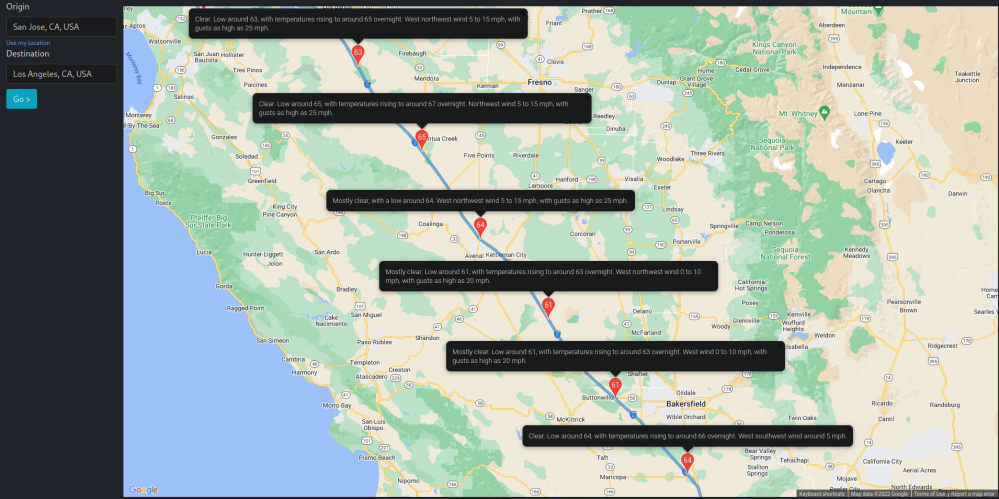

# μClimate
This project is the submission from Group 12 for CMPE 133 SEC 01 - Software Engineer II for the Spring 22 semester at San Jose State University.

# About

Our website provides real-time data on the current weather conditions along with route directions.
It provides more accurate and updated weather information that correlates to the estimated arrival time so that a driver will be aware of what they will experience during their travel.  

The web Application utalizes the Google Maps API to provide drivin routes for a user in tandum with the National Oceanic and Atmoshpheric Administration API (NOAAAPI) which provides weather information, specifically - sky conditions, temptreture, expected chanage in temperature, and
wind statistics. 

# Features
* highlight driving route from user inputted origin to destination
* detailed weather summary of multiple points along route

# Installation

## Getting Started
See below for information regarding API access.
* Google Maps API acess and information: (https://mapsplatform.google.com/)
* National Oceanic and Atmoshpheric Administration (NOAA) API acess and infromation: (https://www.weather.gov/documentation/services-web-api)

See below for detailed documentation for the individual frontend and backend application.
* [Client](https://github.com/mruiz42/uclimate/blob/main/client/README.md)
* [Backend](https://github.com/mruiz42/uclimate/blob/main/backend/README.md)

# License
Copyright 2022

Permission is hereby granted, free of charge, to any person obtaining a copy of this software and associated documentation files (the "Software"), to deal in the Software without restriction, including without limitation the rights to use, copy, modify, merge, publish, distribute, sublicense, and/or sell copies of the Software, and to permit persons to whom the Software is furnished to do so, subject to the following conditions:

The above copyright notice and this permission notice shall be included in all copies or substantial portions of the Software.

THE SOFTWARE IS PROVIDED "AS IS", WITHOUT WARRANTY OF ANY KIND, EXPRESS OR IMPLIED, INCLUDING BUT NOT LIMITED TO THE WARRANTIES OF MERCHANTABILITY, FITNESS FOR A PARTICULAR PURPOSE AND NONINFRINGEMENT. IN NO EVENT SHALL THE AUTHORS OR COPYRIGHT HOLDERS BE LIABLE FOR ANY CLAIM, DAMAGES OR OTHER LIABILITY, WHETHER IN AN ACTION OF CONTRACT, TORT OR OTHERWISE, ARISING FROM, OUT OF OR IN CONNECTION WITH THE SOFTWARE OR THE USE OR OTHER DEALINGS IN THE SOFTWARE.